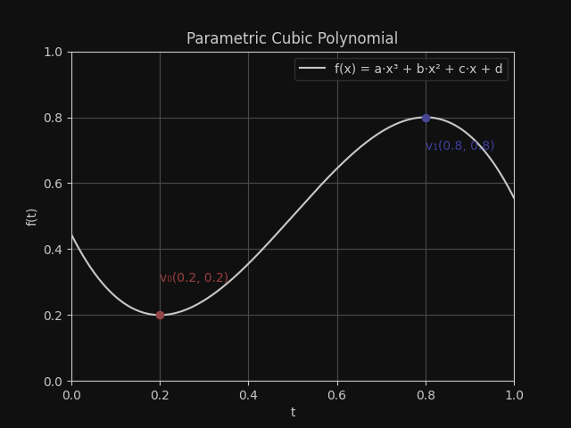
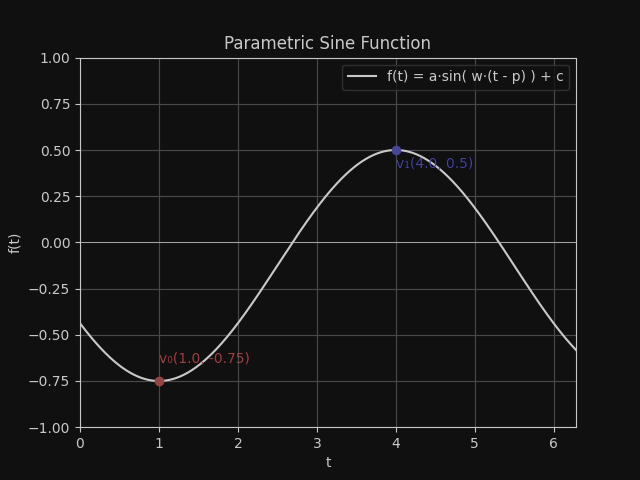

# Parametric Function Reference Program


<p align="center">
  &emsp;
  &emsp;
</p>

A Python program that demonstrates how to compute parametric functions given two turning points.
- In the current version of this test program, the following parametric functions are computed.
  -  Sine function of the form, $f(t) = a \cdot \sin(w \cdot (t - p)) + c$, given two turning points. 
  -  Cubic polynomial of the form, $f(x) = a \cdot x^3 + b \cdot x^2 + c \cdot x + d$, given two turing points.

- The program also shows how to find solutions for the coefficients of a cubic polynomial, given two turning points.

## 📑 Table of Contents
1. [🔧 Installation](#-installation)
2. [🚀 Usage](#-usage)
3. [📐 Mathematical principles](#-mathematical-principles)
5. [📄 License](#-license)

## 🔧 Installation

### Prerequisites

- Python 3.x

### Steps

1. Clone the repository:
    ```sh
    git clone https://github.com/your-username/your-repo.git
    ```

2. Navigate to the project directory:
    ```sh
    cd your-repo
    ```

3. Create and activate the virtual environment using the provided batch files:
    - To create the virtual environment and activate it, run:
      ```sh
      venv_create.bat
      ```
    - If you need to activate the virtual environment later, run:
      ```sh
      venv_activate.bat
      ```
    - To deactivate the virtual environment, run:
      ```sh
      venv_deactivate.bat
      ```
    - To delete the virtual environment, run:
      ```sh
      venv_delete.bat
      ```

4. Install the required packages:
    ```sh
    venv_install_requirements.bat
    ```

5. To save the current list of installed packages to `venv_requirements.txt`, run:
    ```sh
    venv_save_requirements.bat
    ```

## 🚀 Usage

### Parametric Functions

The functions `cubic_segment` and `sin_segment` are the parametric functions demonstrated in this program.

Both functions take two input vector parameters that serve as the parametric points through which the functions pass. 
- Parameters:
  - Vector for point 1. $...\vec{p_0} ( x_0, y_0 )$
  - Vector for point 2. $...\vec{p_1} ( x_1, y_1 )$
- Return:
  - [ Array of x values, Array of y values ] $...\vec{Y} = f ( \vec{X} )$ 

The functions may be tested by setting up input vectors that represent turning points through which the function passes. 

```python
# Test parametric cubic polynomial 

v0   = [  0.2 ,  0.2  ]
v1   = [  0.8 ,  0.8  ]
data = cubic_segment ( v0, v1 )
```

```python
# Test parametric sine function.

v0 = [  1.0 , -0.75  ]
v1 = [  4.0 ,  0.5   ]
data = sin_segment ( v0, v1 )
```

### Parametric Function Return Data

Output data is returned as two arrays, one for the function domain (independent variable), and range (dependent variable).
- In terms of notation, we'll express the domain for linear algebraic functions as $x$, and for trigonometric functions, we'll express it as $t$.
- In the example below, we will use the data to plot the computed parametric functions.
- See the implementation of the `plot_function` for the details of the plots shown below. 
  
```python
# Test parametric cubic polynomial function.

v0   = [  0.2 ,  0.2  ]
v1   = [  0.8 ,  0.8  ]
data = cubic_segment ( v0, v1 )

# Plot the computed function.

lim_x = [  0.0,  1.0  ]
lim_y = [  0.0,  1.0  ]
plot_function (
    data,
    [ v0, v1 ],
    [ lim_x, lim_y ],
    'Parametric Cubic Polynomial', 'f(x) = a·x³ + b·x² + c·x + d'
) 
```

<p align="center">
  
</p>

```python
# Test parametric sine function.

v0 = [  1.0 , -0.75  ]
v1 = [  4.0 ,  0.5   ]
data = sin_segment ( v0, v1 )

# Plot the computed function.

lim_x = [  0, 2*PI ]
lim_y = [ -1, 1    ]
plot_function (
    data,
    [ v0, v1 ],
    [ lim_x, lim_y ],
    'Parametric Sine Function',
    'f(t) = a·sin( w·(t - p) ) + c'
) 
```

<p align="center">
  
</p>


## 📐 Mathematical principles


### Parametric Solutions for Cubic Polynomial Coefficient

- Note:
  - Parameters computed using symbolic solver from the Python `sympy` package.
  - In the code, the `solve_cubic_coefficients()` function implements the `sympy` symbolic solution to compute the coeficients.
  
- Given:

$$f(x) = a x^3 + b x^2 + c x + d \quad \quad \text{...Cubic polynomial function.}$$ 

$$f'(x) = \dfrac{dy}{dx} = 3 a x^2 + 2 b x + c \quad \quad \text{...Derivative of } f_x.$$

$$ p_0 ( x_0, y_0 ) \quad \quad \text{...First turning point.} $$

$$ p_1 ( x_1, y_1 ) \quad \quad \text{...Second turning point.} $$

- System of equations to solve:

$$ y_0 = a x_0^3 + b x_0^2 + c x_0 + d \quad \quad ...(1) \quad f_x \text{ passes through } p_0. \quad f(x_0) = y_0 $$

$$ y_1 = a x_1^3 + b x_1^2 + c x_1 + d \quad \quad ...(2) \quad f_x \text{ passes through } p_1. \quad f(x_1) = y_1 $$

$$ 0 = 3 a x_0^2 + 2 b x_0 + c \quad \quad ...(3) \quad \text{Gradient of } f_x \text{ is zero at } p_0. \quad f'(x_0) = 0 $$

$$ 0 = 3 a x_1^2 + 2 b x_1 + c \quad \quad ...(4) \quad \text{Gradient of } f_x \text{ is zero at } p_1. \quad f'(x_1) = 0 $$

- Constraints:

$$ 0 \leq x_0 \leq x_1 \quad \quad ...p_0 \text{ comes before } p_1. $$

$$ y_0 \neq y_1 \quad \quad ...P_0 \text{ and } P_1 \text{ are not in the same place.} $$

- Coefficient (Paramter) Solutions:

$$ a = \dfrac{ 2 y_1 - 2 y_0 }{ x_0^3 - 3 x_1 x_0^2 + 3 x_0 x_1^2 - x_1^3 } $$

$$ b = \dfrac{ 3 x_0 y_0 - 3 x_0 y_1 + 3 x_1 y_0 - 3 x_1 y_1 }{ x_0^3 - 3 x_1 x_0^2 + 3 x_0 x_1^2 - x_1^3 } $$

$$ c = \dfrac{ 6 x_0 x_1 y_1 + 6 x_0 x_1 y_0 }{ x_0^3 - 3 x_1 x_0^2 + 3 x_0 x_1^2 - x_1^3 } $$

$$ d = \dfrac{ y_1 x_0^3 + 3 x_1 y_1 x_0^2 + 3 x_0 x_1 y_0^2 - x_1 y_0^3 }{ x_0^3 - 3 x_1 x_0^2 + 3 x_0 x_1^2 - x_1^3 } $$


### Parametric Solutions for Sine Function Parameters

- Note:
  - Parameters computed intuitively. No need to formally solve the system of equations.  

- Given:

$$ f(t) = a \cdot \sin \left( w \cdot ( t - p ) \right) + c \quad \quad \text{...Parametric sine function.} $$ 

$$ f'(t) = a \cdot w \cdot \cos \left( w \cdot ( t - p ) \right) \quad \quad \text{...Derivative of } f_t. $$

- System of equations to solve:

$$ f(t_0) = y_0 \quad \quad ...(1) \quad f_t \text{ passes through } p_0. $$

$$ f(t_1) = y_1 \quad \quad ...(2) \quad f_t \text{ passes through } p_1. $$

$$ f'(t_0) = 0 \quad \quad ...(3) \quad \text{Gradient of } f_t \text{ is zero at } p_0. $$

$$ f'(t_1) = 0 \quad \quad ...(4) \quad \text{Gradient of } f_t \text{ is zero at } p_1. $$

- Constraints:

$$ 0 \leq t_0 \leq t_1 \quad \quad ...p_0 \text{ comes before } p_1. $$

$$ y_0 \neq y_1 \quad \quad ...P_0 \text{ and } P_1 \text{ are not in the same place.} $$

- Paramter Solutions:

$$ a = - \dfrac{ y_1 - y_0 }{ 2 } \quad \quad \text{...Amplitude.} $$

$$ w = \dfrac{ \pi }{ t_1 - t_0 } \quad \quad \text{...Frequency.} $$

$$ p = t_0 - \dfrac{ \pi }{ 2 \cdot w } \quad \quad \text{...Phase shift. i.e. Horizontal displacement.} $$

$$ c = \dfrac{ y_1 + y_0 }{ 2 } \quad \quad \text{...Vertical shift. i.e. Vertical displacement.} $$

## 📄 License

This project is licensed under the **MIT License** — see the [LICENSE](LICENSE) file for the full text.
